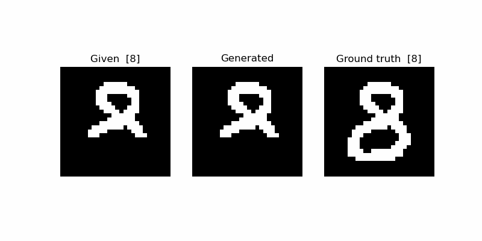
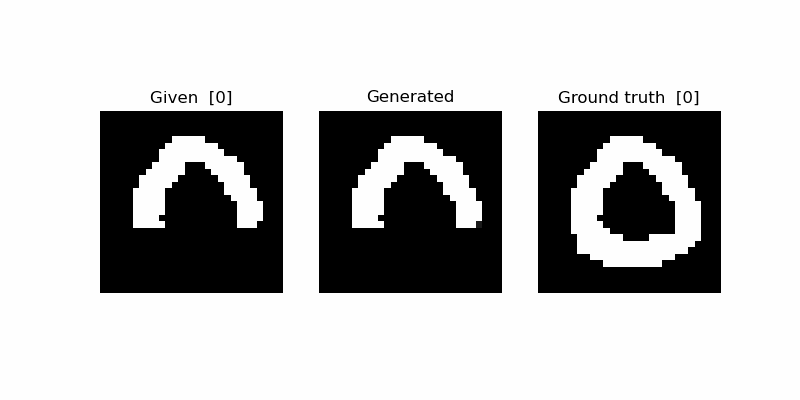
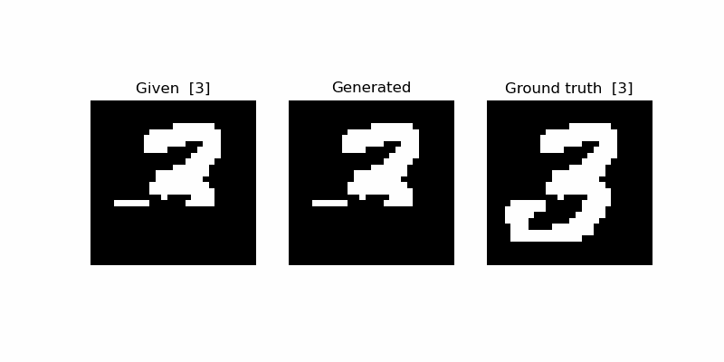
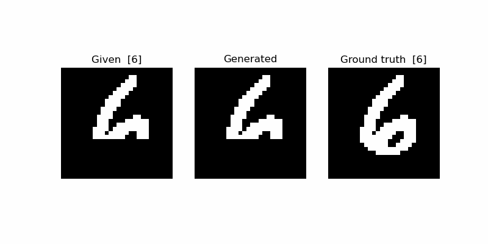
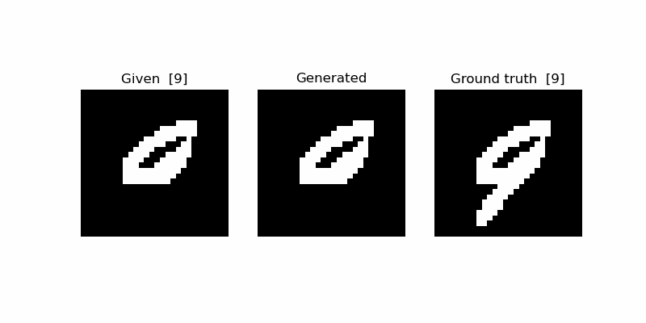
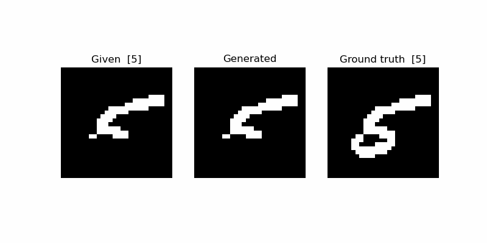

# Generating MNIST with a Recurrent Neural Network

A fun little project to get started with the Recurrent Neural Network (RNN) API in PyTorch.

## The idea

Many of us have classified MNIST images before. Let's try something different to explore the magic of RNNs.

First, let's flatten the 28x28 images of handwritten digits into sequences of pixel values.

In phase 1 (*training*), we'll train an RNN to predict 
the next pixel given a sequence of pixels. In phase 2 (*testing*), we'll then ask: can this RNN generate realistic-looking
MNIST images? To test this we'll present the model with partially masked, unseen MNIST digits
and ask it to complete them.

The goal here is not to chase state-of-the-art performance at image generation but
to understand the capabilities of RNNs with a simple example.

## Experiment

Here are the details of the first experiment:

### Architecture 

* Gated Recurrent Unit (GRU)
* 1 layer with 128 units
* sigmoid output

### Training hyperparameters

* Pixel values are binarised to be either {0,1}
* Trained via **teacher forcing**, i.e. at each time step *t* the ground truth input is presented to the model, not its output from step *t-1*
* Loss: `MSE`
* Optimiser: `Adam`

## Results

Even after just a few epochs the model starts completing many digits sensibly:
it knows where the digits need to continue; it also frequently infers correctly
which digit it needs to draw based on the occluded digit - something that is not always obvious.
It then gets their overall gestalt right. 

Quite cool considering that:
1. the model has never seen 2D images, only pixel sequences
2. we have never told the model explicitly that the digits 0-9 exist (unlike in a classification setting)

Here are some examples. 

* *left*: the masked pixel sequence given to the model (500 pixels)
* *center*: the completion by the model (284 pixels)
* *right*: the ground truth image (digit in brackets)







There are still failure cases like this 5:



## Limitations & improvements

The simple model here is trained fully via *teacher forcing*. That means that at each time step it receives the ground truth
pixel from each training example as input, rather than its own prediction. 
The advantage is this approach is that it provides strong supervision and the model learns fast.

However, this is very different to what happens at test time when we ask the model to complete the digits. 
Now, the model has no access to any ground truth. Instead, it is rolled out for almost 300 time steps and is using its own 
prediction at step *t* as input at step *t+1*. Small prediction "errors" at early time steps will lead to atypical inputs 
in the following time steps which in turn will lead to poorer predictions - a process that can easily compound over the 
course of each generated sequence.

One simple, intuitive way to address this issue is to simply let the model use its own prediction more during training
and become more teacher-independent.
For example, at each time step *t* we could randomly choose with some probability *p* whether to
use teacher forcing or the model output. And it would probably make sense to use teacher forcing in the early stages
of training and then use the model predictions more and more to gradually make training more
similar to inference.

This particular approach is called **scheduled sampling** and has been proposed by Bengio et al. in [3]. The teacher forcing 
probability starts at 1.0 at the beginning of training and is then reduced via certain schedules (e.g. linear, exponential).
Since then there have been extensions to this approach such as "Professor Forcing" [4] but the idea is the same.

## Usage

You can re-create my `conda` environment via

```shell
conda env create -f env.yml
```

To run experiments


```shell
conda activate pytorch

python train.py --exp-name gru-128 --hidden 128
```
see `train.py` for all available command line options.

Each experiment produces two files: 
1. a results file (`.pkl`) containing training/test metrics
2. a model checkpoint (`.ckpt`) 

which are written to a subfolder `{exp_name}` in `experiments` (configurable via command line).

## Resources

[1] Alex Graves. 2014. ["Generating Sequences With Recurrent Neural Networks"](https://arxiv.org/pdf/1308.0850)

[2] Andrej Karpathy. 2015. ["The Unreasonable Effectiveness of Recurrent Neural Networks"](https://karpathy.github.io/2015/05/21/rnn-effectiveness/)

[3] Samy Bengio, Oriol Vinyals, Navdeep Jaitly and Noam Shazeer. 2015. ["Scheduled Sampling for Sequence Prediction with
Recurrent Neural Networks"](https://arxiv.org/pdf/1506.03099)

[4] Alex Lamb, Anirudh Goyal, Ying Zhang , Saizheng Zhang, Aaron Courville, Yoshua Bengio. 2016. ["Professor Forcing: A New Algorithm for Training
Recurrent Networks"](https://arxiv.org/pdf/1610.09038)