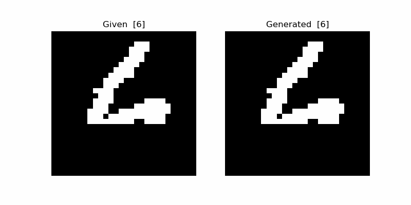
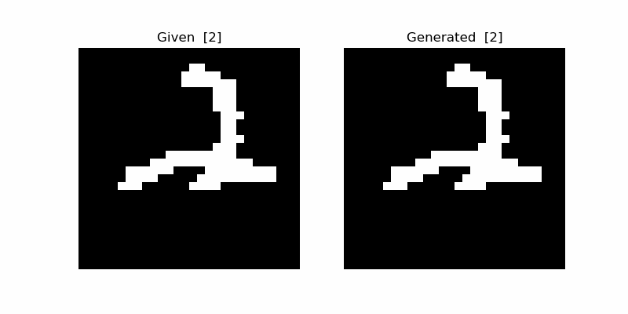
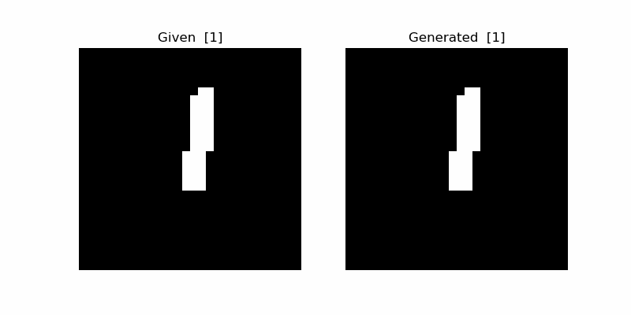
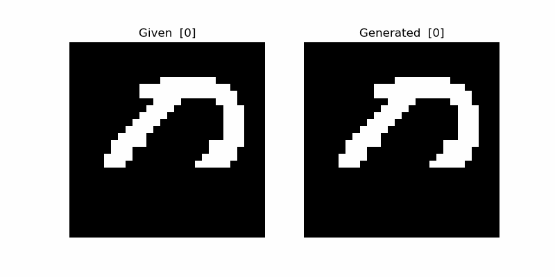

# Generating MNIST with a Recurrent Neural Network

A fun little project to learn how to train Recurrent Neural Networks (RNN) in PyTorch.

## The idea

* **step 1**: train an RNN on images of handwritten digits (MNIST) to predict the next pixel
* **step 2**: use the model to complete images of partially masked, unseen digits

## Results

After just a two or three epochs the model starts completing many digits sensibly:
it knows where the digits need to continue; it also frequently infers correctly
which digit it needs to draw based on the occluded digit - something that is not always obvious.
It then gets their overall gestalt right more often than not. 

Quite cool considering that we have never told the model explicitly that the digits 0-9 exist, 
unlike when we train classfication models.

Here are some random examples:

## Details

*(WIP)*